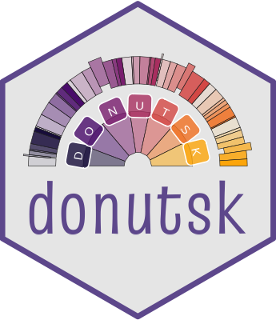

<!-- README.md is generated from README.Rmd. Please edit that file -->

```{r, include = FALSE}
knitr::opts_chunk$set(
  collapse = TRUE,
  comment = "#>",
  fig.path = "man/figures/README-",
  out.width = "100%"
)
```

# donutsk </a>

<!-- badges: start -->

[](https://github.com/dkibalnikov/donutsk/actions/workflows/R-CMD-check.yaml)
[](https://app.codecov.io/gh/dkibalnikov/donutsk?branch=main)
<!-- badges: end -->

The Donutsk package allows you to build donut/pie charts with ggplot2 layer by layer, exploiting the advantages of polar symmetry.

## Installation

You can install the development version of donutsk from [GitHub](https://github.com/) with:

``` r
# install.packages("devtools")
devtools::install_github("dkibalnikov/donutsk")
```

## Example

Basic example:

```{r example, fig.height=7, fig.width=7, crop =TRUE}
library(donutsk)

# Create an example data set
n <- 40
set.seed(2021)
df <- dplyr::tibble(
 lvl1 = sample(LETTERS[1:5], n, TRUE),
 lvl2 = sample(LETTERS[6:24], n, TRUE),
 value = sample(1:20, n, TRUE),
 highlight_ext = sample(c(FALSE,TRUE), n, TRUE, c(.9, .1))) |>
 dplyr::mutate(highlight_int = dplyr::if_else(lvl1 == "A", TRUE, FALSE))

# Starting plot with doubled donuts and annotations for internal one
p <- dplyr::group_by(df, lvl1, lvl2, highlight_ext, highlight_int) |>
 dplyr::summarise(value = sum(value), .groups = "drop") |>
 packing(value, lvl1) |>
 ggplot(aes(value = value, fill = lvl1)) +
 geom_donut_int(aes(highlight = highlight_int), alpha=.5, r_int = .25) +
 geom_label_int(aes(label = "Sum {fill}:\n{.sum} ({scales::percent(.prc)})"),
  alpha = .6, col = "white", size = 3, r=1.2) +
 geom_donut_ext(aes(alpha = ordered(lvl2), highlight = highlight_ext)) +
 scale_fill_viridis_d(option = "inferno", begin = .1, end = .7) +
 guides(alpha = guide_legend(ncol = 2), fill = guide_legend(ncol = 2)) +
 theme_void() + 
 theme(legend.position = "none") 

# An advanced donut chart 
p + coord_polar(theta = "y") +
 geom_label_ext(aes(col = lvl1, label = paste0(lvl2, ": {scales::percent(.prc_grp)}")),
                show.legend = FALSE, size=3, col="white", layout = tv(thinner = TRUE)) +
 geom_pin(size = .5, linewidth=.1, show.legend = FALSE, layout = tv(thinner = TRUE), cut = .2)
```
