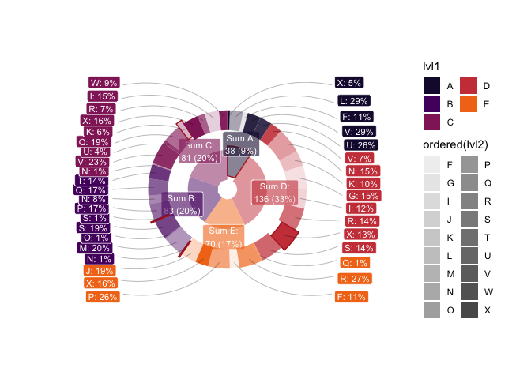

<!-- README.md is generated from README.Rmd. Please edit that file -->

# donutsk

<!-- badges: start -->
<!-- badges: end -->

The Donutsk package allows you to build donut/pie charts with ggplot2
layer by layer, exploiting the advantages of polar symmetry.

## Installation

You can install the development version of donutsk from
[GitHub](https://github.com/) with:

``` r
# install.packages("devtools")
devtools::install_github("dkibalnikov/donutsk")
```

## Example

Basic example:

    #> Loading required package: ggplot2
    #> Warning: Computation failed in `stat_pin_head()`.
    #> Caused by error in `filter()`:
    #> ! object 'xend' not found


