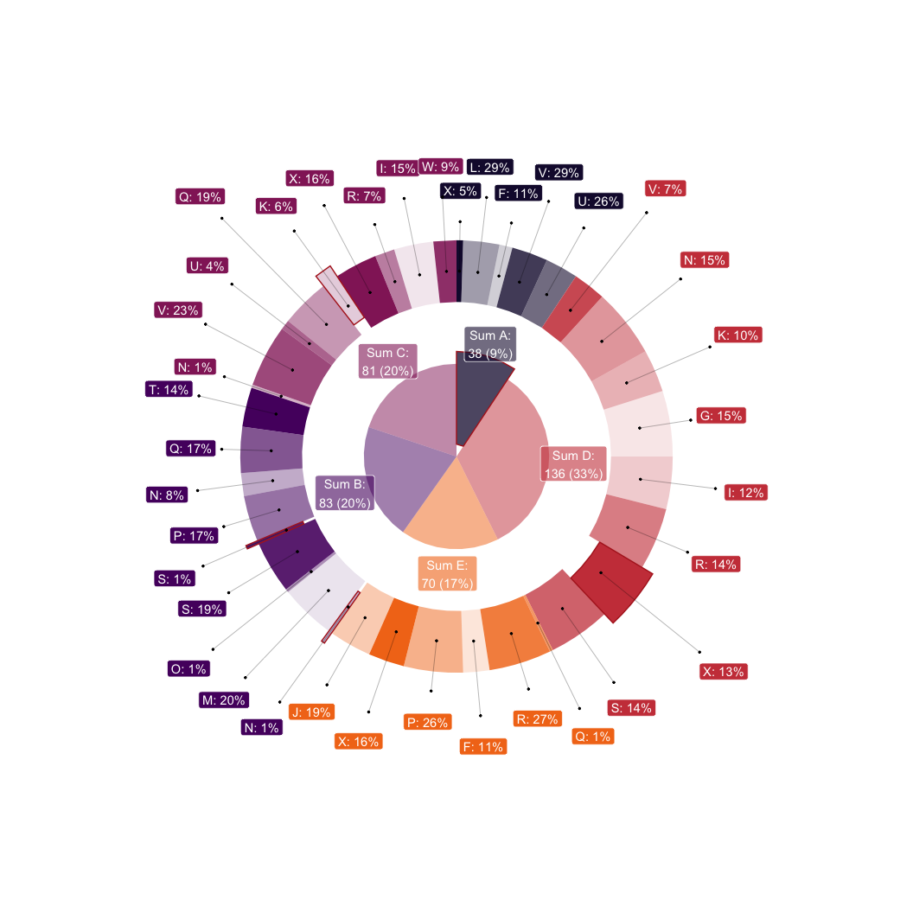

<!-- README.md is generated from README.Rmd. Please edit that file -->

# donutsk <a href="https://dkibalnikov.github.io/donutsk/"></a>

<!-- badges: start -->

[](https://github.com/dkibalnikov/donutsk/actions/workflows/R-CMD-check.yaml)
[](https://app.codecov.io/gh/dkibalnikov/donutsk?branch=main)
<!-- badges: end -->

The Donutsk package allows you to build donut/pie charts with ggplot2
layer by layer, exploiting the advantages of polar symmetry. The package
is designed to address the limitations of pie charts, which are
well-known, while also capitalizing on their ability to effectively
represent hierarchical data structures. The following features are worth
to be highlighted:

- Create pie or donut charts while retaining ggplot2 flexibility, such
  as leveraging faceting and palettes, and fine-tuning appearance
- The layout functions help to streamline displaying text and labels
  *geoms* without overlapping effectively leveraging space available for
  pie and donut charts
- The `packing()` function arranges data to distribute small values
  further apart from each other
- The set of annotation functions utilizes layout functions to
  effectively distribute labels within the available space
- The label functions supports `glue::glue()` for convenient label
  construction like `Total: {.sum}`, where `.sum` is pre-calculated
  variable.

## Installation

You can install the development version of donutsk from
[GitHub](https://github.com/) with:

``` r
# install.packages("devtools")
devtools::install_github("dkibalnikov/donutsk")
```

CRAN installation:

``` r
install.packages("donutsk")
```

## Example

Basic example:

``` r
library(donutsk)
#> Loading required package: ggplot2

# Create an example data set
n <- 40
set.seed(2021)
df <- dplyr::tibble(
 lvl1 = sample(LETTERS[1:5], n, TRUE),
 lvl2 = sample(LETTERS[6:24], n, TRUE),
 value = sample(1:20, n, TRUE),
 highlight_ext = sample(c(FALSE,TRUE), n, TRUE, c(.9, .1))) |>
 dplyr::mutate(highlight_int = dplyr::if_else(lvl1 == "A",TRUE,FALSE))

# Doubled donut with advanced labeling 
dplyr::group_by(df, lvl1, lvl2, highlight_ext, highlight_int) |>
  dplyr::summarise(value = sum(value), .groups = "drop") |>
  # Pack values effectively 
  packing(value, lvl1) |> 
  ggplot(aes(value = value, fill = lvl1)) +
  # The donutsk visualization functions
  geom_donut_int(aes(highlight = highlight_int), alpha=.5, r_int = .25) +
  geom_label_int(aes(label = "Sum {fill}:\n{.sum} ({scales::percent(.prc)})"),
                 alpha = .6, col = "white", r=1.2) +
  geom_donut_ext(aes(opacity = lvl2, highlight = highlight_ext)) +
  geom_label_ext(aes(label = paste0(lvl2, ": {scales::percent(.prc_grp)}")),
                 show.legend = FALSE, col="white", 
                 layout = tv(thinner = TRUE)) +
  geom_pin(size=.5, linewidth=.1, show.legend = FALSE, cut = .25,
           layout = tv(thinner = TRUE)) +
  # Additional appearance settings
  scale_fill_viridis_d(option = "inferno", begin = .1, end = .7) +
  theme_void() + 
  theme(legend.position = "none")  + 
  coord_polar(theta = "y")
```



## Alternatives

There is a list of packages that can be considered as alternatives:

- [sunburstR](https://github.com/timelyportfolio/sunburstR/): Easily
  create interactive d3.js sequence sunburst charts in R, originally
  modeled on an example from Kerry Rodden. Additionally, sunburstR
  provides another version using d2b from Kevin Warne.
- [tastypie](https://github.com/PaoloDalena/tastypie/): Build pie charts
  with nice templates.
- [webr](https://github.com/cardiomoon/webr): Check the `PieDonut()`
  function.
- [ggpubr](https://github.com/kassambara/ggpubr/): The ‘ggpubr’ package
  provides easy-to-use functions for creating and customizing
  ‘ggplot2’-based publication-ready plots. Check `ggpubr::ggpie()` for
  details.

## Considerations

The following list of ideas is considered as a kind of roadmap:

1.  Integrate round annotations with
    [geomtextpath](https://allancameron.github.io/geomtextpath/) under
    the hood.
2.  Expand the list of layouts with more sophisticated algorithms
3.  Integrate pattern aesthetics with
    [ggpattern](https://coolbutuseless.github.io/package/ggpattern/index.html)
4.  Calculate the precise square value for highlighted segments to
    adjust size
